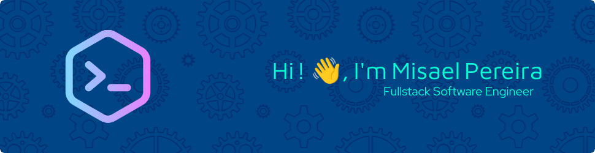

<!-- https://leviarista.github.io/github-profile-header-generator/ -->

    

<h2 align="left">💫 About Me</h2>
<h3 align="center">"Lorem ipsum dolor sit amet, consectetur adipiscing elit, sed do eiusmod tempor incididunt ut labore et dolore magna aliqua. Ut enim ad minim veniam, quis nostrud exercitation ullamco laboris nisi ut aliquip ex ea commodo consequat.</h3>

🔭 I’m currently working on  
👯 I’m looking to collaborate on  
🤝 I’m looking for help with  
🌱 I’m currently learning  
💬 Ask me about  
⚡ Fun fact  
📫 How to reach me  

<!-- -->
<h2>🌐 Socials</h2>

    

<!-- https://devicon.dev/ -->
<h2 align="left">💻 Tech Stack</h2>

    <h3>Frontend</h3>
    
    
    
    
    
    
    
    
    <h3>Transport</h3>
    
        
        
        
        
    <h3>Backend</h3>
    </a>
            
    </a>
        
    </a>
        
    </a>
        
    </a>
        
    </a>
        
    </a>
        
    </a>
        
    <h3>Database</h3>
    </a>
        
    </a>
        
    </a>
        
    </a>
        
    <h3>DevOps</h3>
    </a>
        
    </a>
        
    </a>
        
    </a>
        
    </a>
        
    </a>
        
    </a>
        
    

<!-- To-do: add CDN, Ansible, Terraform, Mocha, Chai, Sinon, Playwriht, Storybook -->

<h2>📊 GitHub Stats</h2>

    
    
    

