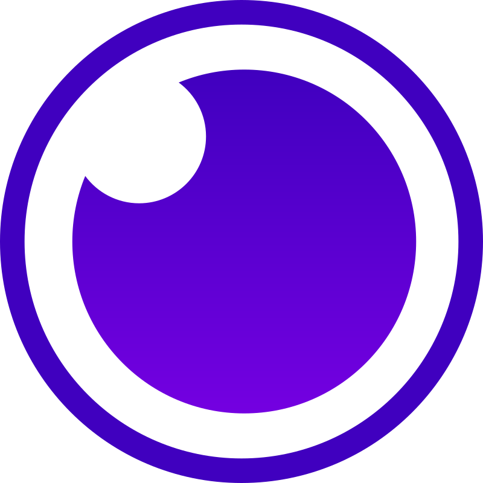

<!-- Banner image generated with Leonardo AI -->
<!-- 
    Leonardo AI Prompt:

    Misael Pereira, full-stack software engineer, banner illustration, against a gradient of dark blue to deep purple night sky at dusk, evoking innovation and professionalism, with subtle circuit board patterns and thin coding symbols etched in a metallic silver hue, blending seamlessly with futuristic coding interface lines in shades of electric blue and bright green, modern, simple, and minimalist, surrounded by clean, bold typography with a hint of metallic finish, conveying cutting-edge expertise.
-->

    

<h2>💫 About Me</h2>

Hello! I'm <b>Misael Pereira</b>, a <b>FullStack Software Engineer</b> and passionate developer with experience in <b>Backend, Frontend, and DevOps</b>. I enjoy creating efficient and scalable technological solutions using tools and technologies like <b>Spring Boot, Web Components</b>, and cloud platforms such as <b>Azure</b>.

My primary focus is on developing web applications that are functional, robust, and high-performing, seamlessly integrating frontend design with complex backend logic. I am also interested in automating processes and optimizing infrastructures through modern <b>DevOps</b> practices.

<!-- https://es.piliapp.com/emoji/list/ -->
🔭 I’m currently working on: <a href="https://github.com/misaelpereiradev?tab=projects" target="_blank" rel="noreferrer" >Misael Pereira's Projects</a> 
🌱 I’m currently learning: <b>Azure</b>                          
💬 Ask me about: <b>Programing 🖥️, Gaming 🎮, Fantasy 🦄</b>     
📫 How to reach me: <b>Look at Socials Section 👇</b>            

<!--
👯 I’m looking to collaborate on: TBA                            
🤝 I’m looking for help with: TBA                                
⚡ Fun fact: TBA                                                 
-->

<!-- https://shields.io/ -->
<h2>🌐 Socials</h2>

    
    

<!-- https://devicon.dev/ -->
<h2>💻 Tech Stack</h2>

    <h3>Frontend</h3>
    
    
    
    
    
    
    
    
    
    
    
    <h3>Backend</h3>
    
    
    
    
    
    
    
    
    
    <h3>DevOps</h3>
    
    
    
    
    
    
    
    
    

<!-- To-do: add CDN, Ansible, Terraform, Helm -->

<!-- https://devicon.dev/ -->
<h2 align="left">🛠️ Tools</h2>

    <h3>Software</h3>
    
    
    
    
    
    
    
    
    
    <h3>Links</h3>
    <ul>
        <li><a href="https://outlook.live.com/" target="_blank" rel="noreferrer">Outlook</a></li>
        <li><a href="https://github.com/" target="_blank" rel="noreferrer">Github</a></li>
        <li><a href="https://circleci.com/" target="_blank" rel="noreferrer">CircleCI</a></li>
        <li><a href="https://hub.docker.com/" target="_blank" rel="noreferrer">DockerHub</a></li>
        <li><a href="https://portal.azure.com/" target="_blank" rel="noreferrer">Azure</a></li>
        <li><a href="https://www.gitbook.com/" target="_blank" rel="noreferrer">GitBook</a></li>
        <li><a href="https://www.eraser.io/" target="_blank" rel="noreferrer">Eraser</a></li>
        <li><a href="https://open-wc.org/" target="_blank" rel="noreferrer">Open Web Components</a></li>
        <li><a href="https://start.spring.io/" target="_blank" rel="noreferrer">Spring Initializr</a></li>
    </ul>
    <h3>AI</h3>
    <ul>
        <li><a href="https://chatgpt.com/" target="_blank" rel="noreferrer">ChatGPT</a></li>
        <li><a href="https://leonardo.ai/" target="_blank" rel="noreferrer">Leornado.AI</a></li>
    </ul>

<h2>📊 GitHub Stats</h2>

    

        
    

    

        
    

    

        
    

