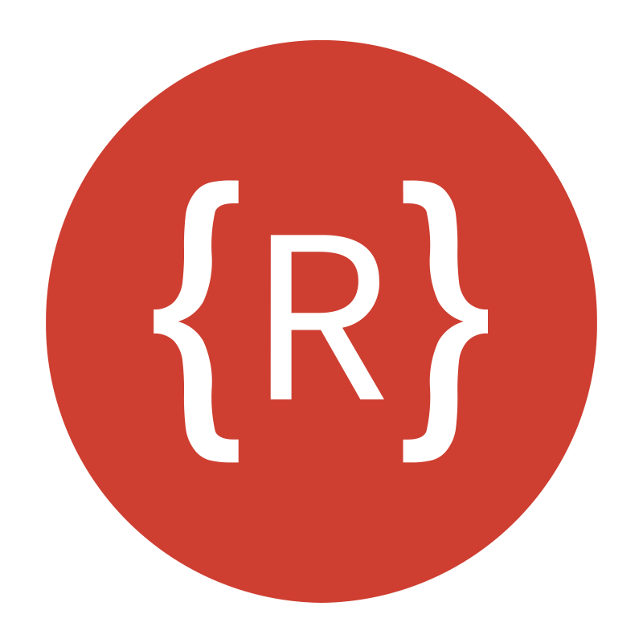

<!-- Banner image generated with Leonardo AI -->
<!-- 
    Leonardo AI Prompt:

    Misael Pereira, full-stack software engineer, banner illustration, against a gradient of dark blue to deep purple night sky at dusk, evoking innovation and professionalism, with subtle circuit board patterns and thin coding symbols etched in a metallic silver hue, blending seamlessly with futuristic coding interface lines in shades of electric blue and bright green, modern, simple, and minimalist, surrounded by clean, bold typography with a hint of metallic finish, conveying cutting-edge expertise.
-->

    

<h2 align="left">💫 About Me</h2>
<h3 align="center">"Lorem ipsum dolor sit amet, consectetur adipiscing elit, sed do eiusmod tempor incididunt ut labore et dolore magna aliqua. Ut enim ad minim veniam, quis nostrud exercitation ullamco laboris nisi ut aliquip ex ea commodo consequat.</h3>

<!-- https://es.piliapp.com/emoji/list/ -->
🔭 I’m currently working on: TBA                         
👯 I’m looking to collaborate on: TBA                    
🤠I’m looking for help with: TBA                        
🌱 I’m currently learning: TBA                           
💬 Ask me about: TBA                                     
⚡ Fun fact: TBA                                         
📫 How to reach me: <b>Look at Socials Section 👇</b>    

<!-- https://shields.io/ -->
<h2>🌐 Socials</h2>

    
    

<!-- https://devicon.dev/ -->
<h2 align="left">💻 Tech Stack</h2>

    <h3>Frontend</h3>
    
    
    
    
    
    
    
    
    
    
    
    
    
    <h3>Backend</h3>
    
    
    
    
    
    
    
    
    
    
    
    <h3>DevOps</h3>
    
    
    
    
    
    
    
    

<!-- To-do: add CDN, Ansible, Terraform, Helm -->

<!-- https://devicon.dev/ -->
<h2 align="left">🛠️ Tools</h2>

    <h3>Softwares</h3>
    
    
    
    
    
    
    
    
    <h3>Links</h3>
    <ul>
        <li><a href="https://outlook.live.com/" target="_blank" rel="noreferrer">Outlook</a></li>
        <li><a href="https://github.com/" target="_blank" rel="noreferrer">Github</a></li>
        <li><a href="https://circleci.com/" target="_blank" rel="noreferrer">CircleCI</a></li>
        <li><a href="https://hub.docker.com/" target="_blank" rel="noreferrer">DockerHub</a></li>
        <li><a href="https://www.oracle.com/es/cloud/" target="_blank" rel="noreferrer">Oracle Cloud</a></li>
        <li><a href="https://www.mongodb.com/atlas/database" target="_blank" rel="noreferrer">MongoDb Atlas</a></li>
        <li><a href="https://upstash.com/" target="_blank" rel="noreferrer">Upstash</a></li>
        <li><a href="https://start.spring.io/" target="_blank" rel="noreferrer">Spring Initializr</a></li>
    </ul>

<h2>📊 GitHub Stats</h2>

    

        
    

    

        
    

    

        
    

